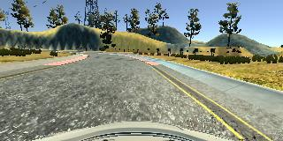
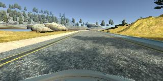
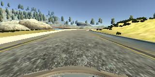
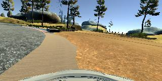
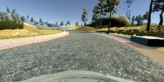
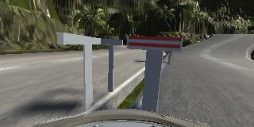

#**Behavioral Cloning** 

---

**Behavioral Cloning Project**

The goals / steps of this project are the following:

* Use the simulator to collect data of good driving behavior
* Build, a convolution neural network in Keras that predicts steering angles from images
* Train and validate the model with a training and validation set
* Test that the model successfully drives around track one without leaving the road
* Summarize the results with a written report


[//]: # (Image References)

[image1]: ./examples/placeholder.png "Model Visualization"
[image2]: ./examples/placeholder.png "Grayscaling"
[image3]: ./examples/placeholder_small.png "Recovery Image"
[image4]: ./examples/placeholder_small.png "Recovery Image"
[image5]: ./examples/placeholder_small.png "Recovery Image"
[image6]: ./examples/placeholder_small.png "Normal Image"
[image7]: ./examples/placeholder_small.png "Flipped Image"


Here I will consider the [rubric points](https://review.udacity.com/#!/rubrics/432/view) individually and describe how I addressed each point in my implementation.  

---
### Rubrics: Files Submitted & Code Quality

#### 1. Submission includes all required files and can be used to run the simulator in autonomous mode

My project includes the following files:

* model.py containing the script to create and train the model
* drive.py for driving the car in autonomous mode
* model.h5 containing a trained convolution neural network 
* project3\_writeup_hong.md summarizing the results
* run4_track1.mp4 for test results on Track 1
* run4_track2.mp4 for test results on Track 2


#### 2. Submission includes functional code
Using the Udacity provided simulator and my drive.py file, the car can be driven autonomously around the track by executing 

```sh
python drive.py model.h5 run
```

#### 3. Submission code is usable and readable

The model.py file contains the code for training and saving the convolution neural network. The file shows the pipeline I used for training and validating the model, and it contains comments to explain how the code works.

### Rubrics: Model Architecture and Training Strategy

#### 1. An appropriate model architecture has been employed

The Nvidia structure is adopted which is a convolution neural network with 3x3 filter sizes and depths between 100 and 1. The model includes ELU layers to introduce nonlinearity, and the data is normalized in the model using a Keras lambda layer (code line 69). 

#### 2. Attempts to reduce overfitting in the model

The model contains dropout layers in order to reduce overfitting (model.py lines 80 and 82). 

The model was trained and validated on a large augmented data set to ensure that the model was not overfitting (code line 58-81). The model was tested by running it through the simulator and ensuring that the vehicle could stay on the track.

#### 3. Model parameter tuning

The model used an adam optimizer, so the learning rate was not tuned manually (model.py line 108).

The `ANGLE_CORRECTION` parameter is fine tuned through trial and eror. The initial `ANGLE_CORRECTION` is set to 0.2. Interesting results were observed: the car tends to drive towards the right lane on counter-clockwise loops, while towards teh left lane on clockwise loops, as demonstrated in the following images. 

 
 


Perfomance was improved by increasing the `ANGLE_CORRECTION` to 0.25, as can be seen from the image below.



#### 4. Appropriate training data

Initially, I trained the network using training data I generated playing the simulator. However, the dataset didn't give me plausible results, due to the handling errors while playing the game with a mouse. I ended up with mixing my training data with those provided by udacity. I also used a combination of center lane driving, recovering from the left and right sides of the road.
All images are mirrored to double the size of training data.


## Model Architecture and Training Strategy

#### 1. Solution Design Approach

The overall strategy for deriving a model architecture was to take the data, mirror it, normalize it, augment it and use images from three camera angles.

My first step was to use a convolution neural network model similar to the Nvidia network. This mdoel is chosen based on the reported proven performance o similiar datasets.
In order to gauge how well the model was working, I split my image and steering angle data into a training and validation set (20%). I found that my first model had a low mean squared error on the training set but a high mean squared error on the validation set. To reduce overfitting, I modified the model so that it had dropout layers.

The final step was to run the simulator to see how well the car was driving around track one. There were a few spots where the vehicle fell off the track... to improve the driving behavior in these cases, I balanced and added curve driving to the data. This resulted in the following distribution

At the end of the process, the vehicle is able to drive autonomously around the track without leaving the road.

#### 2. Final Model Architecture

The final model architecture (model.py lines 18-24) consisted of a convolution neural network with the following layers and layer sizes 

- Normalization layer
- Cropping layer
- Convolution layer with 24 filters and 5x5
- Convolution layer with 36 filters and 5x5
- Convolution layer with 48 filters and 5x5
- Convolution layer with 64 filters and 3x3
- Convolution layer with 64 filters and 3x3
- A flatten layer
- Fully connected layer with 100 nodes
- Fully connected layer with 50 nodes
- Fully connected layer with 10 nodes
- Fully connected layer with 1 node

I used an adam optimizer so that manually training the learning rate wasn't necessary. 7 epochs was simulated.


#### 3. Creation of the Training Set & Training Process
#### Creation of the Training Set

Initially, I trained the network using training data I generated playing the simulator. However, the dataset didn't give me plausible results, due to the handling errors while playing the game with a mouse. I ended up with mixing my training data with those provided by udacity. I also used a combination of center lane driving, recovering from the left and right sides of the road.
All images are mirrored to double the size of training data.

The generated dataset was randomly shuffled 20% of the data formed a validation set. 

I used this training data for training the model. The validation set helped determine if the model was over or under fitting. 

#### Training Process
Even after cropping and resizing training images (with all augmented images), training dataset was quite large. I used fit_generator API of the Keras library for training our model. A `generator` function was defined (model.py line 32 - 60) to generate batches of images. Batch size for the generator was 64. 

This resulted in a learning rate as shown here

 "Model Visualization"

#### 4. Results
Using the Udacity provided simulator and my model.h5 file, the car can be driven autonomously around the track by executing

`sh
python drive.py model.h5 run
`

Results can be seen in the attached .mp4 files. For track 1, the car drives pretty well. At certain points, the car almost drives off road, but succeeded to return to center of road:




For track 2, however, the model didn't work. The car immediately tried to drive into the opposite lane...



## Conclusions and Future Directions
Training datasets did make huge impact on the quality of behavior cloing model. In the initial phase, I trained the model with a small (and unsteady) dataset I generated and it didn't work well. The dataset provided by Udacity didn't contain enough data points on curved roads. So I manually generated these datasets. By combining these two sources of data, I managed to generate a model that drived the car pretty well on Track 1. 

When it comes to extensions and future directions, I would like to add more training data from Track 2 to improve the model's performance on Track 2. Also, it would be interesting to investigate the impact of model parameters suchs as batch size and training epochs on the model performance. Quantative study of the effect of `ANGLE_CORRECTION` also seems interesting. 


